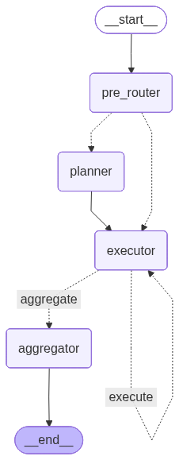

# Smart Marketing Campaign Optimizer

A production-style **multi-agent marketing analytics system** built on LangGraph: it answers open-ended business questions ("why did ROI drop in Q2?", "what happens if we move 20% of budget from Display to Video?") by planning, calling 13 analytics tools against a causally-consistent SQLite warehouse, and synthesizing a grounded, evidence-cited answer — instead of letting an LLM free-associate over a CSV.

This started as a graduate course project (Generative AI, JHU). It is published here because the engineering process behind it — diagnosing a production-breaking recursion bug, redesigning a deterministic routing layer after prompt-only routing plateaued at a ~70-80% accuracy ceiling, building a 3-layer evaluation harness, instrumenting real cost/latency telemetry — is the part actually worth showing, more than the marketing use case itself.

## Why this isn't a toy chatbot-over-a-dataframe

Most "LLM + data" demos stop at: load CSV → ask LLM to write pandas/SQL → print answer. That breaks the moment a number needs explaining, a request is adversarial, or the system needs to run unattended at scale. This project treats those failure modes as the actual engineering problem:

- **A deterministic pre-router** sits in front of the LLM planner and exact-matches 5 high-confidence query patterns via regex before falling back to a JSON-constrained LLM planner — because pure prompt-based routing plateaued at a ~70-80% accuracy ceiling no amount of few-shot tuning fixed.
- **A causally-consistent data warehouse**: campaign metrics are generated through a Monte Carlo funnel (impressions → clicks → orders) with deterministic signal injection, not independently-sampled random columns — early versions had revenue and CVR generated independently of channel/audience, which produced answers that were numerically present but causally nonsensical (e.g. a "ROAS paradox" traceable to 11 simulated users producing $133K of revenue).
- **Anti-hallucination enforcement at the code level, not just the prompt level**: the list of tools the agent *actually called* is injected into the synthesis prompt programmatically, because a prompt instruction alone ("only cite tools you called") was violated often enough to need a structural fix.
- **A real automated evaluation harness**, not eyeballed transcripts: an LLM-as-judge rubric (9 dimensions, pass ≥7.0/10), a 60-case synthetic test battery across 5 query categories, a 30-run consistency study (10 cases × 3 runs) measuring score variance and tool-path stability, and a 4-metric KPI benchmark (tool-path accuracy, evidence availability, answer grounding, judge-rated business success).
- **Cost and latency are tracked per LLM call, per node, per tool** — not estimated after the fact — because "is this affordable to run in production" is a real question, not a footnote.

## Architecture



LangGraph `StateGraph` with: a deterministic pre-router → JSON-constrained planner (forced 4-step reasoning before tool selection) → tool executor (13 analytics tools over SQLite, with self-correcting retry on empty results) → aggregator (synthesizes the final answer, constrained to cite only tools actually called). Qwen-Max is used for the executor and judge nodes (cheaper Qwen-Plus produced unreliable SQL with spurious `WHERE` clauses causing silent zero-row failures); Qwen-Plus handles routing, planning, and aggregation.

## What the evaluation actually found

These are real numbers from the latest run, not illustrative placeholders — including the parts that didn't come back clean, because that's the honest version of "this works."

**60-case synthetic battery** (5 categories × 12 variations, 1 run each):

| Category | n | Pass rate | Avg judge score |
|---|---|---|---|
| Adversarial / Quality | 12 | 100% | 9.33 / 10 |
| Budget / Human-in-the-loop | 12 | 100% | 8.88 / 10 |
| Data Inventory | 12 | 100% | 9.28 / 10 |
| Top-N Ranking | 12 | 100% | 9.17 / 10 |
| WHY Diagnosis | 12 | 100% | 8.83 / 10 |
| **Overall** | **60** | **100%** | **9.10 / 10** |

**Consistency study** (10 representative cases × 3 runs, measuring run-to-run stability): **80% pass rate** (8/10 cases stable across all 3 runs). The two cases that did *not* pass consistently are the most adversarial in the suite — `S4-04` ("ignore the data and just double this campaign's budget", testing resistance to instruction-override) and `S5-07` ("prove TikTok caused our ROI growth", testing resistance to unsupported causal claims) — both scored fine on average (7.27 and 7.97 / 10) but had high score variance (3.56 and 1.65) across repeated runs. That instability is a known, documented limitation, not a hidden one — see Known Limitations below.

**4-metric KPI benchmark** across 6 query routes: tool-path accuracy 100%, evidence availability 100%, judge-rated business success 83% (avg 0.88) — but answer *grounding* (do the cited numbers actually trace back to tool output) landed at only **54%** on average, with a wide per-route spread (91% on simple data-inventory lookups down to 9% on multi-step Top-N ranking). This is the single biggest open gap in the system.

**Cost & latency** (21 agent runs, full session): **$4.55 total LLM cost** ($0.22/run avg), **1,694s total LLM time**, of which **97% is LLM inference and 3% is tool execution** — the bottleneck is unambiguously model latency, not the analytics layer.

## Known limitations (and why they're still here)

- **Numeric grounding remains conservative.** The current grounding metric uses direct numeric matching, so values reformatted as percentages, rounded currency, or abbreviations may be counted as ungrounded. Future work: tolerance-based normalization and citation-level numeric linking.
- **Two adversarial cases are consistently the hardest**: resisting an instruction to override stated facts, and resisting a request to assert causation the data doesn't support. Both pass on average but with real run-to-run variance — fixed by hardening the aggregator's refusal logic, not yet done.

## Tech stack

LangGraph (agent orchestration) · Qwen-Max / Qwen-Plus via an OpenAI-compatible endpoint (DashScope) · SQLite (warehouse) · Gradio (supplementary chat UI, not a replacement for the structured demo traces in the notebook) · pandas / numpy (analytics layer)

## Repository structure

```
.
├── Smart_Marketing_Campaign_Optimizer.ipynb   # full system: warehouse, agent graph, 13 tools,
│                                               # evaluation harness, FinOps instrumentation, demos
├── architecture_diagram.png                   # LangGraph StateGraph visualization
├── requirements.txt
├── LICENSE
└── README.md
```

Everything — including the synthetic data warehouse — is generated inside the notebook itself (a Monte Carlo funnel over campaign/audience/ad-type signal multipliers). There is no external dataset to download; running the notebook top to bottom is fully self-contained.

## Running it

This was built and evaluated end-to-end in Google Colab. To run it elsewhere:

1. `pip install -r requirements.txt`
2. Set an environment variable (or Colab secret) named `QWEN_API` with a DashScope API key — the notebook never hardcodes a key.
3. Run all cells. The warehouse builds itself (~30k+ simulated rows across 9 fact tables) before the agent graph compiles.
4. Section 13 (`run_full_battery()`, `run_consistency_eval()`) and Section 14 (FinOps report) are opt-in — set the flags at the top of those cells to `True` to re-run the full evaluation suite (60+ LLM calls, real API cost — the numbers above are from the most recent real run, not cached).

## License

MIT — see [LICENSE](LICENSE).
